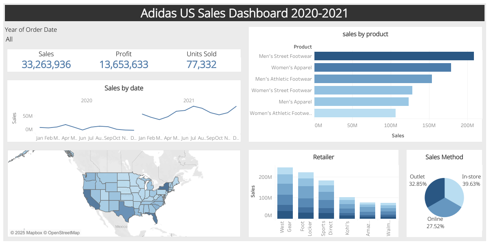

# 📊 Adidas US Sales Dashboard (2020–2021)

---

## 🎯 Objective

The goal of this project is to analyze Adidas sales data in the United States using an interactive dashboard.  
This project is designed as a showcase of data cleaning, analysis, and visualization skills suitable for a **Junior Data Analyst** portfolio.

---

## 🛠 Tools Used

- **Excel** – Data cleaning and formatting  
- **Tableau Public** – Dashboard creation and data visualization  

---

## 🧩 Process

1. **Data Import & Exploration**
   - Source: `Adidas US Sales.xlsx`

2. **Data Cleaning in Excel**
   - Checked for missing/null values
   - Renamed columns for clarity
   - Converted dates and numeric values to correct formats

3. **Dashboard Creation in Tableau**
   - Show kpls of dashboard
   - Built visualizations for sales by date, region, product type and retailer and visualization for sales method
   - Used filters for dynamic exploration by order date
   
4. **Publishing**
   - Shared via Tableau Public  
   - Link: [Click to view dashboard](https://public.tableau.com/app/profile/narueporn.j/viz/AdidasUSSalesDashboard_17493753391160/Dashboard2#1)

---

## 🔰 Insights

- **Men’s Street Footwear** generated the highest revenue
- Sales increased significantly in 2021 compared to 2020
- The **Western region** showed higher sales concentration
- Retailers like **West Gear** and **Foot Locker** had the strongest performance
- **In-store** was the top sales channel, followed by **Outlet** and **Online**

---

Created by **Narueporn J.** | For Data Analyst Portfolio | Feel free to connect or leave feedback! ☺
