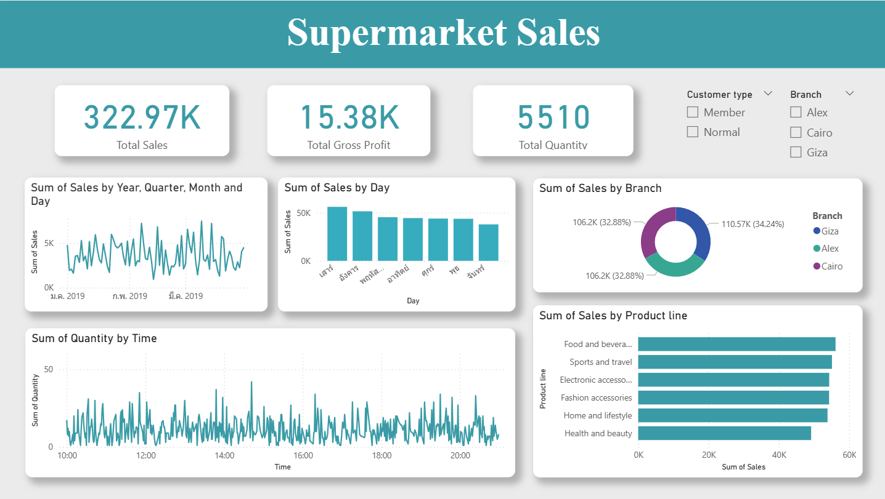

# 📊 Supermarket Sales Analysis & Insights

---

## 🎯 Business Questions
วิเคราะห์ยอดขาย กำไร และทำความเข้าใจพฤติกรรมการซื้อของลูกค้า
ตอบคำถาม Business Questions
* สาขาใดมียอดขายสูงสุด และสาขาใดมียอดขายต่ำสุด?
* สินค้ากลุ่มใดทำกำไรสูงสุดและต่ำสุด?
* ลูกค้าประเภทใดปริมาณการซื้อสูงกว่ากัน?
* ยอดขายและปริมาณขายสูงสุดอยู่ช่วงเวลาไหนของวัน?

## 📋 Dataset Overview
Dataset: [Kaggle Link](https://www.kaggle.com/datasets/faresashraf1001/supermarket-sales)
* ข้อมูลยอดขายจาก 3 สาขาใน 3 เมือง
* ระยะเวลา: 3 เดือน ในปี 2019
* Data size: 1,000 x 17 
* คอลัมน์หลัก: สาขา, ลูกค้า (Member/Non-member), ประเภทสินค้า, ยอดขาย, รายได้สุทธิกำไร, วิธีการชำระเงิน เป็นต้น

## 🛠️ Tools Used & Process
* **Power BI**
   - ใช้ Power Query ในการ clean data และเตรียมข้อมูลก่อน import เข้า Power BI เช่น แปลง data type ให้อยู่ในรูปแบบที่ถูกต้อง, เปลี่ยนชื่อ column เพื่อให้เข้าใจง่าย และลบค่าที่ซ้ำกัน
   - ใช้ Data Model ในการสร้างความสัมพันธ์กับ table Day of 2019 ที่ต้องใช้ในการทำ report 
   - สร้าง Visualizations และ Report
* **Google Slides** สำหรับทำ presentation & storytelling ของ project ให้เข้าใจได้ง่ายขึ้น

## 🌄 Report Preview: Supermarket Sales

View Presentation: [Supermarket Sales Presentation](https://docs.google.com/presentation/d/1YZsdNW8JvuJZGjVsojj8t3gujRozNylPAm6B0jq8uOo/edit?usp=sharing)

## 🧩 Key Insights
จากการวิเคราะห์ข้อมูลผ่าน Report พบว่า:
* Supermarket สาขา Giza มียอดขายสูงสุด รองลงมาคือสาขา Alex และ Cairo
* สินค้าที่มียอดขายสูงสุง คือ สินค้า Food & Beverages ส่วนสินค้าที่มียอดขายต่ำสุง คือ สินค้า Health & Beauty
* ลูกค้าที่เป็น Member มียอดการซื้อสินค้าสูงกว่าลูกค้าที่ไม่ได้เป็น Member คิดเป็น 42.34%
* วันเสาร์เป็นวันที่มียอดขายมากทึ่สุด ส่วนวันที่มียอดขายน้อยที่สุด คือ วันจันทร์ และปริมาณการซื้อมีความผันผวนสูงตลอดทั้งวัน แต่มีช่วง Peak อย่างชัดเจน 2 ช่วง ได้แก่
   - ช่วง Peak ช่วงบ่าย (ประมาณ 14:00 น. - 15:00 น.) ในช่วงเวลานี้กราฟพุ่งแตะระดับ 40-50 หน่วย 
   - ช่วง Peak ช่วงค่ำ/ก่อนปิดร้าน (ประมาณ 19:00 น. - 20:30 น.) ในช่วงเวลานี้กราฟพุ่งแตะระดับ 30-40 หน่วย 

## 🔰 Business Recommendations
จากข้อมูลเชิงลึกที่ได้ จึงมีข้อเสนอแนะกลยุทธ์ทางธุรกิจดังนี้:
* Supermarket สาขา Cairo มีประสิทธิภาพการขายสูงสุด ควรการศึกษาปัจจัยความสำเร็จของสาขาแห่งนี้ แล้วนำไปปรับใช้กับสาขา Alex และ Giza เพื่อเพิ่มยอดขายให้เติบโตได้เท่าเทียมกัน
* ควรจัดการสต็อกสินค้า Food and beverages เพื่อรักษาความเป็นผู้นำด้านยอดขาย และจัดโปรโมชั่นสินค้า Health & Beauty เพื่อกระตุ้นยอดขายให้สูงขึ้น
* ควรส่งเสริมให้ลูกค้าสมัคร Member เพราะลูกค้าที่เป็น Member มีการใช้จ่ายมากกว่าลูกค้าที่ไม่ได้เป็น Member
* ช่วงบ่ายและช่วงค่ำเป็น Peak Hours ควรจัดสรรพนักงานแคชเชียร์และพนักงานเติมสินค้าให้เพียงพอในช่วงเวลานี้ เพื่อลดเวลารอของลูกค้าและเพิ่มประสิทธิภาพในการขาย

---

Created by **Narueporn J.** | For Data Analyst Portfolio | Feel free to connect or leave feedback! ☺

